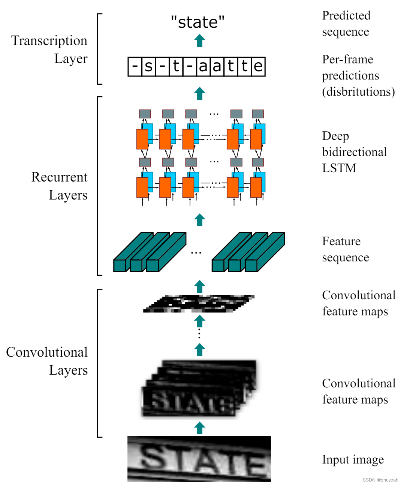

Convolutional Recurrent Neural Network
======================================

This software implements the Convolutional Recurrent Neural Network (CRNN) in pytorch.
Origin software could be found in [crnn](https://github.com/bgshih/crnn)
项目来自：https://github.com/meijieru/crnn.pytorch

## CRNN
CRNN实现端到端的不定长文本识别<br>
主要包含三部分：卷积层（CNN）、循环层（RNN）、转录层（CTC）

CRNN三个部分实现的功能：
> 1. CNN:通过深层卷积操作，通过卷积和Maxpooling堆叠提取图像的局部特征，用到卷积的平移不变性质；
> 2. RNN:循环层使用深层的双向LSTM，对特征序列进行预测，输出预测标签的分布。判断特征序列表示的是那个字符；
> 3. CTC:转录层使用CTC loss,将循环层获取的一系列标签转换成最终的文本识别标签结果。

**CRNN输入图片的要求：**
输入图像为单通道的灰度图；<br>
图像高度为32，经过卷积处理后高度变为1；<br>
训练过程中输入图片的宽度为100，图片大小为（100,32,1）；<br>

代码中判断图片高度是否能够被16整除。
```python
assert imgH % 16 == 0
```


Run demo
--------
A demo program can be found in ``demo.py``. Before running the demo, download a pretrained model
from [Baidu Netdisk](https://pan.baidu.com/s/1pLbeCND) or [Dropbox](https://www.dropbox.com/s/dboqjk20qjkpta3/crnn.pth?dl=0). 
This pretrained model is converted from auther offered one by ``tool``.
Put the downloaded model file ``crnn.pth`` into directory ``data/``. Then launch the demo by:

    python demo.py

The demo reads an example image and recognizes its text content.

Example image:


Expected output:
    loading pretrained model from ./data/crnn.pth
    a-----v--a-i-l-a-bb-l-ee-- => available

Dependence
----------
* [warp_ctc_pytorch](https://github.com/SeanNaren/warp-ctc/tree/pytorch_bindings/pytorch_binding)
* lmdb

Train a new model
-----------------
1. Construct dataset following [origin guide](https://github.com/bgshih/crnn#train-a-new-model). If you want to train with variable length images (keep the origin ratio for example), please modify the `tool/create_dataset.py` and sort the image according to the text length.
2. Execute ``python train.py --adadelta --trainRoot {train_path} --valRoot {val_path} --cuda``. Explore ``train.py`` for details.
