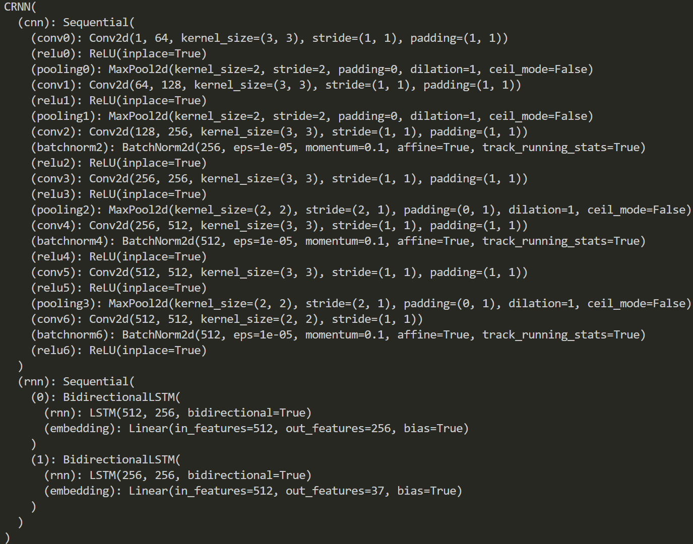
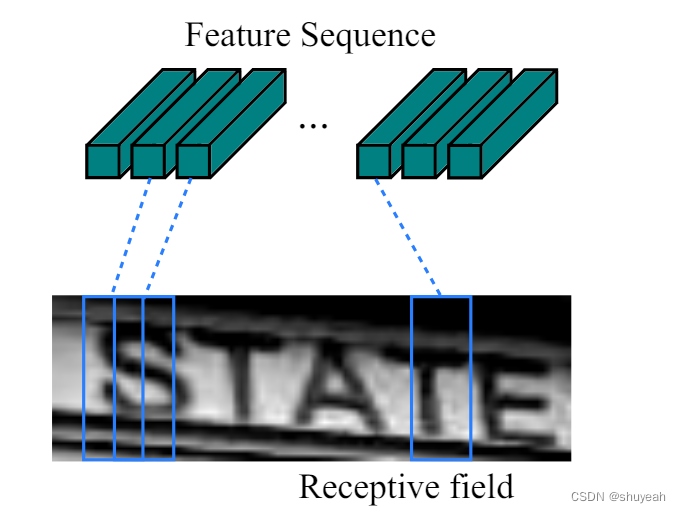

Convolutional Recurrent Neural Network
======================================

This software implements the Convolutional Recurrent Neural Network (CRNN) in pytorch.
Origin software could be found in [crnn](https://github.com/bgshih/crnn)<br>
项目来自：https://github.com/meijieru/crnn.pytorch

## CRNN
CRNN实现端到端的不定长文本识别<br>
主要包含三部分：卷积层（CNN）、循环层（RNN）、转录层（CTC）

CRNN三个部分实现的功能：
> 1. CNN:通过深层卷积操作，通过卷积和Maxpooling堆叠提取图像的局部特征，用到卷积的平移不变性质；
> 2. RNN:循环层使用深层的双向LSTM，对特征序列进行预测，输出预测标签的分布。判断特征序列表示的是那个字符；
> 3. CTC:转录层使用CTC loss,将循环层获取的一系列标签转换成最终的文本识别标签结果。

**CRNN输入图片的要求：**
输入图像为单通道的灰度图；<br>
图像高度为32，经过卷积处理后高度变为1；<br>
训练过程中输入图片的宽度为100，图片大小为（100,32,1）；<br>

代码中判断图片高度是否能够被16整除。
```python
assert imgH % 16 == 0
```

## 1.卷积层CNN
卷积层用来提取文本图像的特征，通过堆叠卷积层和最大池化层，特别的，最后两个最大池化层在h和w上的下采样倍数是不相等的，由于待识别的文本图像多数是高度较小而宽度较大，使用1×2的池化窗口能够在尽量不丢失宽度方向的信息。
[卷积操作的具体实现代码：](.\lib\models\crnn.py)
```python
# 输入图片大小为（160，32，1）
assert imgH % 16 == 0, 'imgH has to be a multiple of 16 图片高度必须为16的倍数'
		# 一共有7次卷积操作
        ks = [3, 3, 3, 3, 3, 3, 2]  # 卷积层卷积尺寸3表示3x3，2表示2x2
        ps = [1, 1, 1, 1, 1, 1, 0]  # padding大小
        ss = [1, 1, 1, 1, 1, 1, 1]  # stride大小
        nm = [64, 128, 256, 256, 512, 512, 512]  # 卷积核个数,卷积操作输出特征层的通道数

        cnn = nn.Sequential()
        def convRelu(i, batchNormalization=False):  # 创建卷积层
            nIn = nc if i == 0 else nm[i - 1]  # 确定输入channel维度,如果是第一层网络，输入通道数为图片通道数，输入特征层的通道数为上一个特征层的输出通道数
            nOut = nm[i]  # 确定输出channel维度
            cnn.add_module('conv{0}'.format(i),
                           nn.Conv2d(nIn, nOut, ks[i], ss[i], ps[i]))  # 添加卷积层
            # BN层
            if batchNormalization:
                cnn.add_module('batchnorm{0}'.format(i), nn.BatchNorm2d(nOut))
            # Relu激活层
            if leakyRelu:
                cnn.add_module('relu{0}'.format(i),
                               nn.LeakyReLU(0.2, inplace=True))
            else:
                cnn.add_module('relu{0}'.format(i), nn.ReLU(True))
        # 卷积核大小为3×3,s=1,p=1,输出通道数为64,特征层大小为100×32×64
        convRelu(0)
        # 经过2×2Maxpooling,宽高减半，特征层大小变为50×16×64
        cnn.add_module('pooling{0}'.format(0), nn.MaxPool2d(2, 2))
        # 卷积核大小为3×3,s=1,p=1,输出通道数为128,特征层大小为50×16×128
        convRelu(1)
        # 经过2×2Maxpooling,宽高减半，特征层大小变为25×8×128
        cnn.add_module('pooling{0}'.format(1), nn.MaxPool2d(2, 2))
        # 卷积核大小为3×3,s=1,p=1,输出通道数为256,特征层大小为25×8×256,卷积后面接BatchNormalization
        convRelu(2, True)
        # 卷积核大小为3×3,s=1,p=1,输出通道数为256,特征层大小为25×8×256
        convRelu(3)
        # 经过MaxPooling,卷积核大小为2×2，在h上stride=2，p=0，s=2,h=(8+0-2)//2+1=4,w上的stride=1,p=1,s=1,w=(25+2-2)//1+1=26通道数不变，26×4×256
        cnn.add_module('pooling{0}'.format(2),
                       nn.MaxPool2d((2, 2), (2, 1), (0, 1)))    # 参数 (h, w)
        # 卷积核大小为3×3,s=1,p=1,输出通道数为512,特征层大小为50×16×512,卷积后面接BatchNormalization
        convRelu(4, True)
        # 卷积核大小为3×3,s=1,p=1,输出通道数为512,特征层大小为26×4×512
        convRelu(5)
        # 经过MaxPooling,卷积核大小为2×2，在h上stride=2，p=0，s=2,h=(4+0-2)//2+1=2,w上的stride=1,p=1,s=1,w=(26+2-2)//1+1=27通道数不变，27×2×512
        cnn.add_module('pooling{0}'.format(3),
                       nn.MaxPool2d((2, 2), (2, 1), (0, 1)))
        # 卷积核大小为2×2,s=1,p=0,输出通道数为512,特征层大小为26×1×512
        convRelu(6, True)
```
查看CRNN的网络结构<br>
> python lib\models\crnn.py



卷积操作输出特征层大小为：26×1×512

## 2.循环层RNN
卷积操作输出结果经过处理后输入到RNN。<br>

将H,W维度合并，合并后的维度转换为输入到RNN的时间步长(time_step)，每一个序列长度为原始特征层的通道数；<br>
**输入到LSTM中的特征图大小：**
输入到LSTM的是一维的序列，<br>序列长度为原始特征图的通道数512;<br>
一共输入了h×w=26个时间步长。

序列是对于特征图按照列从左到右生成的，每一列包含512维的特征，输入到LSTM中的第i个特征序列是特征图第i列向量的连接。
由于卷积操作和最大池化的平移不变性，在原图上某一区域对应的特征对应在卷积提取的特征图上仍体现在相同的区域。
因此对于CNN提取的特征图，从左到右进行拆分，每一个特征序列对应在原图上仍是按照从左到右的顺序。


每一个时间步长输入的序列的神经元个数为512；LSTM隐藏层节点数量为256

```python
# LSTM类
class BidirectionalLSTM(nn.Module):

    def __init__(self, nIn, nHidden, nOut):
        super(BidirectionalLSTM, self).__init__()

        self.rnn = nn.LSTM(nIn, nHidden, bidirectional=True)     # nIn：输入神经元个数
        self.embedding = nn.Linear(nHidden * 2, nOut)  # *2因为使用双向LSTM，两个方向隐层单元拼在一起

    def forward(self, input):
        # 经过RNN输出feature map特征结果
        recurrent, _ = self.rnn(input)
        T, b, h = recurrent.size()  # T:时间步长，b:batch size,h:hiden unit
        t_rec = recurrent.view(T * b, h)# 512×batch_size, 256

        output = self.embedding(t_rec)  # [T * b, nOut]
        output = output.view(T, b, -1)

        return output
```
```python
self.rnn = nn.Sequential(
            BidirectionalLSTM(512, nh, nh), # 输入的时间步长为512
            BidirectionalLSTM(nh, nh, nclass))
```

第一次LSTM得到的特征层大小为[26×batch_size, 256],经过view得到[26，batch_size, 256]
第一次LSTM得到的特征层大小为[26×batch_size, num_class],经过view得到[26，batch_size, num_class]

每一个特征序列映射所属字符类别的概率值。

## 转录层CTC
将每一个特征向量预测的结果转换成标签序列的过程。但是由于不定长序列的对齐问题，可能出现一个字符被识别多次的情况，多个特征序列对应同一个标签结果，因此需要去除冗余机制。但是不能直接将重复的文本去除，可能出现原始文本中就包含次重复的情况。所以在**解码**过程中引入blank：

- 在重复的字符之间增加一个空格'-';
- 删除没有空格间隔的重复字符;
- 再去掉字符中所有的'-';

**编码**过程是通过神经网络来实现的，文本标签可以通过不同的字符组合路径得到。
**CTC los损失值如何计算**

p(l|y)=$\sum\limits_{π：B(π)}p(π|y)$

对于一个标签，所有可能得到该标签的所有路径的概率分布。计算每条路径的概率为每一个时间步对应字符分数的乘积。CTC损失函数定义为概率的负最大似然函数，为了计算方便对函数取对数。

## CRNN的预测过程如何实现
- 在测试阶段对于输入图像缩放会导致识别率降低，CRNN需保持输入图像尺寸比例，但是图像高度必须统一为32，卷积特征图尺寸动态决定了输入到LSTM的时序长度（CNN输出的特征图宽度决定了输入到LSTM中的时间步长）；
- 使用标砖的CNN网络提取特征；
- 利用BLSTM将特征向量进行融合，已提取字符序列的上下文特征，得到每列特征的概率分布；
- 通过CTC进行预测得到文本序列；

Run demo
--------
A demo program can be found in ``demo.py``. Before running the demo, download a pretrained model
from [Baidu Netdisk](https://pan.baidu.com/s/1pLbeCND) or [Dropbox](https://www.dropbox.com/s/dboqjk20qjkpta3/crnn.pth?dl=0). 
This pretrained model is converted from auther offered one by ``tool``.
Put the downloaded model file ``crnn.pth`` into directory ``data/``. Then launch the demo by:

    python demo.py

The demo reads an example image and recognizes its text content.

Example image:


Expected output:
    loading pretrained model from ./data/crnn.pth
    a-----v--a-i-l-a-bb-l-ee-- => available

Dependence
----------
* [warp_ctc_pytorch](https://github.com/SeanNaren/warp-ctc/tree/pytorch_bindings/pytorch_binding)
* lmdb

Train a new model
-----------------
1. Construct dataset following [origin guide](https://github.com/bgshih/crnn#train-a-new-model). If you want to train with variable length images (keep the origin ratio for example), please modify the `tool/create_dataset.py` and sort the image according to the text length.
2. Execute ``python train.py --adadelta --trainRoot {train_path} --valRoot {val_path} --cuda``. Explore ``train.py`` for details.
